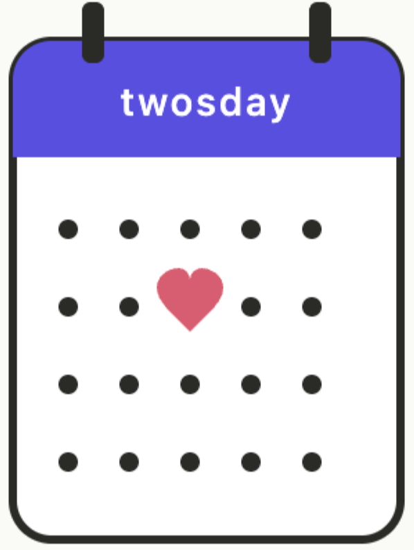

# Twosday

A real-time shared calendar for two people. Each account has two named profiles with their own color, theme, and view — all synced instantly across devices via Firebase.

**Live demo:** [twosday-five.vercel.app](https://twosday-five.vercel.app)



---

## Features

### Calendar views
- **Day** — single-day time grid, full 24 hours
- **Week** — 7-column grid with drag-and-drop
- **Month** — traditional monthly overview
- **Year** — 12 mini-months at a glance

Switch views with the buttons in the header, or press `d`, `w`, `m`, `y`.

### Events
- Click any time slot to create an event
- Drag to move events across days and times
- Drag the top or bottom handle to resize
- Mark events as done (strikethrough)
- Pick from 9 color presets, or let the app auto-color based on keywords (`class` → purple, `meal` → green, `work` → blue, etc.)
- **Shared events** — toggling "shared" mirrors the event to both profiles and keeps them in sync
- **Repeat** — duplicate an event hourly, daily, weekly, or monthly with a live preview before confirming
- **Undo / Redo** — full history stack (up to 80 snapshots), keyboard shortcuts `Cmd+Z` / `Cmd+Y`

### Two-profile system
Each account has two named profiles (e.g. Jeff and Helen). Profiles have independent:
- Color themes (dark or light)
- Tab switching — click the profile name to switch, events update instantly

### Notes
A slide-in notes panel (per profile) for quick freeform text. Double-click any note to edit inline. Synced to Firestore alongside events.

### Search
Press `/` or click the search icon to search events by text across all dates. Click a result to jump directly to that day.

### Real-time sync
All changes save to Firebase Firestore in real-time. Open the app on two devices and edits appear within a second or two, no refresh needed.

---

## Tech stack

| Layer | Choice |
|---|---|
| Frontend | Vanilla JS, HTML5, CSS3 — no framework, no build step |
| Sync | Firebase Firestore (real-time `onSnapshot` listener) |
| Auth | Custom username/password stored in Firestore |
| Persistence | `localStorage` as a cache and offline fallback |
| Hosting | Vercel (auto-deploys on push to `main`) |
| Fonts | DM Sans + DM Mono via Google Fonts |

---

## Project structure

```
Twosday/
├── index.html              # App shell + auth overlay
├── favicon.png             # Tab icon
├── css/
│   └── style.css           # All styles (dark/light themes, grid, modals)
└── js/
    ├── config.js           # Firebase init, shared constants
    ├── auth.js             # Login, signup, session management
    ├── state.js            # Global state, undo/redo, persistence
    ├── utils.js            # Date helpers, uid, color logic
    ├── events.js           # Create, edit, delete, drag-and-drop
    ├── modal.js            # Add/edit event modal
    ├── repeat-modal.js     # Event repeat/duplication modal
    ├── search.js           # Cross-date event search
    ├── notes.js            # Notes panel
    ├── app.js              # Render loop, navigation, boot
    └── views/
        ├── day-week.js     # Day and week time-grid view
        ├── month.js        # Month view
        └── year.js         # Year view
```

---

## Running locally

No build step required — just open `index.html` in a browser.

```bash
git clone https://github.com/jeffzh4/Twosday.git
cd Twosday
open index.html   # or drag into Chrome
```

The app connects to Firebase on load. An internet connection is needed to log in and sync; cached data is available offline after first load.

---

## Keyboard shortcuts

| Key | Action |
|---|---|
| `d` / `w` / `m` / `y` | Switch to day / week / month / year view |
| `←` / `→` | Navigate backward / forward |
| `/` | Open search |
| `Cmd+Z` | Undo |
| `Cmd+Y` or `Cmd+Shift+Z` | Redo |
| `Escape` | Close modal or search |

---

## Data model

Events are stored by date key and profile name:

```js
allData["2026-05-20"]["jeff"] = [
  {
    id: "abc123",
    text: "Team standup",
    start: 9.5,      // 9:30 AM (decimal hours)
    end: 10,         // 10:00 AM
    done: false,
    shared: false,
    color: "blue",
    recurrenceId: null,
  }
]
```

Each account writes to its own Firestore document, so accounts are fully isolated from one another.
